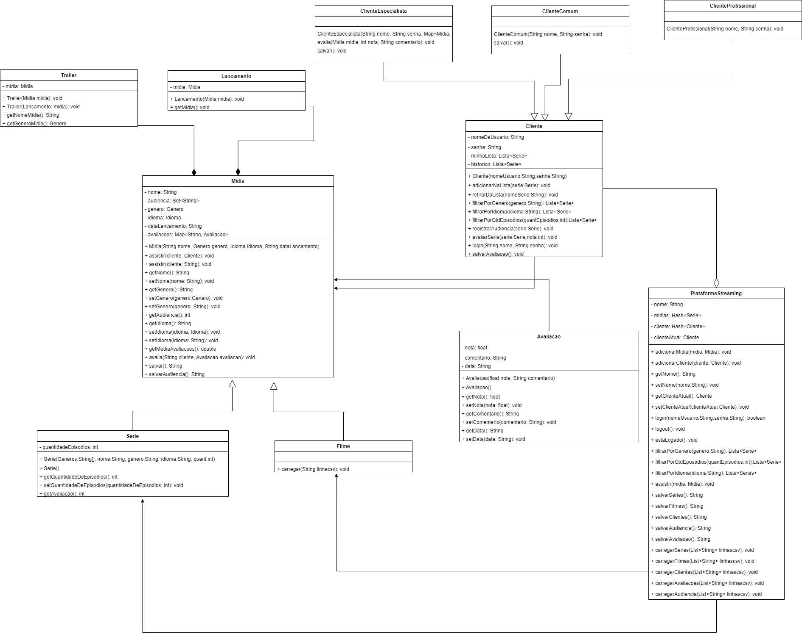

# Diagramas de classe
UML V1.0 -- Criação do diagrama com as Classes de Série, Cliente, e PlataformaStreaming  
UML V1.1 -- Adição da avaliação e dos métodos que utilisam esta variável. 
UML V2.0 -- Adição da Classe de Filme. 
UML V3.0 -- Modificação das Classes Filme e Série, e criação da Classe Midia. 
UML V4.0 -- Ultimas alterações. 
UML V5.0 -- Diagrama final. 
 
